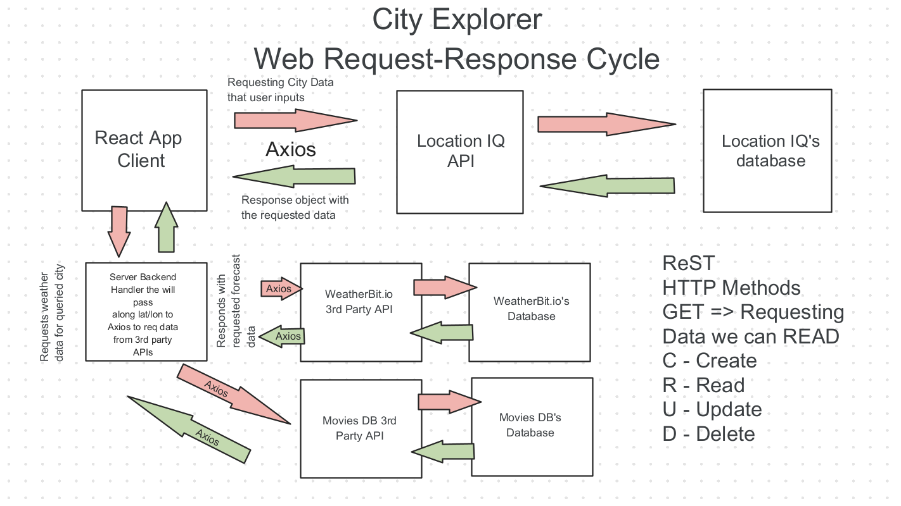

# City Explorer API

**Author**: Dougie Douglas
**Version**: 1.0.3 (increment the patch/fix version number if you make more commits past your first submission)

## Overview

- This API allows the user to access location, weather, and related movie data based on their search inputs. This app calls the LocationIQ, WeatherBit, and Movie DB APIs as appropriate. The frontend is hosted on Netlify and the backend is hosted on Heroku.

## Getting Started

- Refactor all the components on the server to use cache hits for efficiency.

## Architecture

- Modules are being used and called into other files as appropriate to execute the API calls that characterize our frontend experience for the user.

## Change Log

05-14-2022 7:39pm - Application now has a fully-functional express server, with a GET route for the location resource.
05-21-2022 4:27pm - Location map, weather, and movie functionality all operational, to include appropriate error handling. App refactored into modules.
05-29-2022 7:27pm - Caching functionality introduced for the weather and movie APIs.

## Credit and Collaborations

- Special thanks to Zayah Lang and Luis Sandoval for helping debug.

Time Estimates
For each of the lab features, make an estimate of the time it will take you to complete the feature, and record your start and finish times for that feature:

Name of feature: Lab 10 Cache

Estimate of time needed to complete: 4 hours

Start time: 28 May 2022 @ 1200

Finish time: 29 May 2022 @ 2000

Actual time needed to complete: Approx 5 hours
