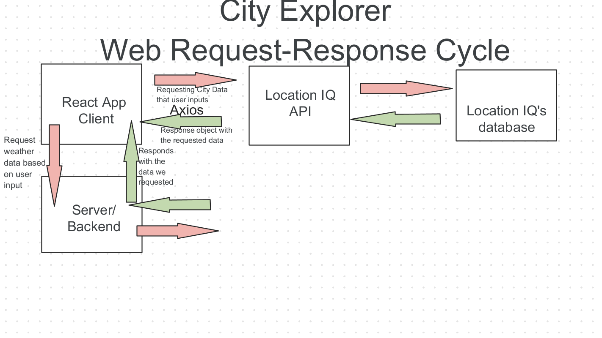

# City Explorer API

**Author**: Dougie Douglas
**Version**: 1.0.0 (increment the patch/fix version number if you make more commits past your first submission)

## Overview

- This API allows the user to access weather data from a locally hosted server based on their search results.

## Getting Started

- Integrate Express, Cors, and dotenv.

## Architecture

- This application uses express, cors, and dotenv to create a locally-hosted server for our City Explorer client.

## Change Log

05-14-2022 7:39pm - Application now has a fully-functional express server, with a GET route for the location resource.

## Credit and Collaborations

Time Estimates
For each of the lab features, make an estimate of the time it will take you to complete the feature, and record your start and finish times for that feature:

Name of feature: Lab 07 Weather API Integration

Estimate of time needed to complete: 4 hours

Start time: 1500

Finish time: 2000

Actual time needed to complete: Approx 5 hours
